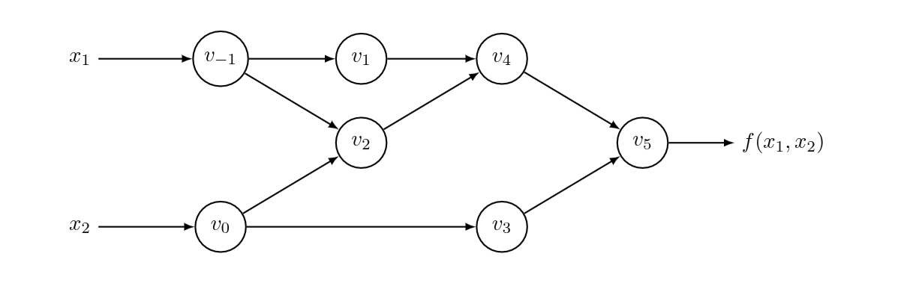

# Automatic Differentiation
### AD Is Not Numerical Differentiation:
Numerical differentiation is the finite difference approximation of derivatives using values of the original function evaluated at some sample points. In its simplest form, it is based on the limit definition of a derivative. 

Limit Definition of Derivative

$$f'(x) = \frac{f(x+h)-f(x)}{h}$$

For example, for a multivariate function $f\colon\mathbb{R^n}\to\mathbb{R}$, you can approximate the gradient as follows:
$$\nabla f = \left(\frac{\partial f}{\partial x_1}, \ldots,\frac{\partial f}{\partial x_n}\right)$$

$$\frac{\partial f(\mathbf{x})}{\partial x_i} \approx \frac{f(\mathbf{x}+h\mathbf{e}_i)-f(\mathbf{x})}{h}$$

where $\mathbf{e}_i$ is the $i$-th unit vector.

Numerical differentiation:
 - uncomplicated to implement
 - performs $O(n)$ evaluations (bad)
 - h must be selected carefully
	 -  If $h$ is too large, you cannot get sufficiently close to the target derivative
	 - if $h$ is too small, you get noise from floating point rounding errors

Different methods have tried to improve this, such as using the midpoint of the interval (center difference), which does improve accuracy by one significant figure, but it still performs too many evaluations, and for a multidimensional function $f\colon\mathbb{R^n}\to\mathbb{R^m}$, you end up performing $2mn$ calculations in addition to imprecision.

### AD Is Not Symbolic Differentiation
Symbolic differentiation is what you do in calculus, e.g. 

$$\frac{d}{dx} (f (x) + g(x)) \implies \frac{d}{dx} f (x) + \frac{d}{dx} g(x)$$ and $$\frac{d}{dx} h(x) = \frac{d}{dx}(f (x) g(x))\implies\left( \frac{d}{dx} f (x)\right)g(x) + f (x)\left( \frac{d}{dx} g(x)\right)$$ 

(product rule).

If we represent our formulae as data structures, symbolic differentiation is deterministic and even Leibniz theorized about automating this process in the 1680s. In math settings, symbolic differentiation can inform you about your problem's domain and potentially even its critical points ($\frac{d}{dx}f(x) = 0$) that would eliminate the need for derivative calculation altogether (since we want to find minima). However, symbolic derivatives can grow in size exponentially and thus become unsuitable for calculation. 

If we think about our product rule example above, $h(x)$ and $\frac{d}{dx}h(x)$ both share $f(x)$ and $g(x)$ as components. Additionally, $f(x)$ and $\frac{d}{dx}f(x)$ (as well as $g(x)$ and $\frac{d}{dx}g(x)$) both appear, individually, so you can symbolically differentiate both $f(x)$ and $g(x)$, and then plug their derivatives in appropriately, we could easily produced nested duplications of computations shared between $f(x),\frac{d}{dx}f(x)$ and $g(x),\frac{d}{dx}g(x)$). While conceptually clean, this produces some problems.

For example, assume a recursive definition for a function $l$

$$l_1 = x,\quad l_{n+1} = 4l_n(1 − l_n),$$

$$f (x) = l_4 = 64x(1 − x)(1 − 2x)^2(1 − 8x + 8x^2)^2,$$

our derivative would be: 

$$\begin{align} f'(x) &= 128x(1 − x)(−8 + 16x)(1 − 2x)^2(1- 8x + 8x^2)\\ 
& \quad + 64(1 − x)(1 − 2x)^2(1 − 8x + 8x^2)^2\\ 
& \quad − 64x(1 − 2x)^2(1 − 8x + 8x^2)^2\\ 
& \quad − 256x(1 − x)(1 −2x)(1 − 8x + 8x^2)
\end{align}$$

This is known as "expression swell." 

Furthermore, symbolic differentiation expects a closed form mathematical expression, and ReLU (`if x > 0 return x else: return 0`) or similar methods are challenging for symbolic differentiatiors to handle.  However, when we care about the (accurate) numerical output,  we can kind of sidestep some of the nastiness of the symbolic form but use a similar technique where we store the values of intermediate sub-expressions in memory and alternate the differentiation and simplification steps as much as possible. Additionally, doing the differentiation in this manner allows AD to trace the execution of the code, not the formula, allowing it to deal with pesky formulas like ReLU. This is the basis of AD and describes it at its simplest form:

> *apply symbolic differentiation at the elementary operation level and keep intermediate numerical results, in lockstep with the evaluation of the main function*

Forward AD works exactly like this, while backwards AD accumulates the same values, just in reverse.

### AD Setup
First, we need to be okay with some notation. For a function $f\colon\mathbb{R^n}\to\mathbb{R^m}$, our intermediate numerical variables will be:
1. $v_{i−n} = x_i$, $i = 1,\ldots, n$ are the input variables
2. $v_{i}$ $i = 1,\ldots, l$ are the working (intermediate) variables
3. $y_{m−i} = v_{l−i}$, $i = m − 1, \dots, 0$ are the output variables.

This indexing is tricky but quite clever once you see it in action:

1. ALL input variables will have negative indices (for example $n=3$ inputs):

$$i=1 \implies v_{-2} = x_1, \quad \quad i=2 \implies v_{-1} = x_2, \quad \quad i=3 \implies v_{0} = x_3$$

3. The intermediate variables are the operations performed by the code (add, multiply, $\sin$, $\ln$, etc.).
	- $l$ is the TOTAL that are performed.
	- $v_1$ is the result of the first operation.
	- $v_2$ is the result of the second operation (which might use $v_1, v_{0},\dots,v_{-2}$).
	- $v_l$ is the result of the very last operation, (which might use $v_{l-1}, v_{l-2},\dots,v_{-2}$).

4.  $m$ is the number of values our function returns. Thus, the LAST $m$ variables will be our outputs. Assuming $m=3$ and unknown $l$ (note, often $m \neq n$):
	- $y_1 = v_{l-2}$
	    $i=m-1=2 \implies  y_{3-2} = v_{l-2}$
	- $y_2 = v_{l-1}$
	    $i=m-2=1 \implies  y_{3-1} = v_{l-1}$
	- $y_3 = v_{l}$
		$i=m-3=0 \implies  y_{3-0} = v_{l}$

Often you will not reach all of your outputs at the same time, but the way this list is constructed, a copy/identity operation will be added to "drag" the required values to the end of the list so that $v_{l-m}, \dots, v_l$ are the output values. This might seem inefficient, but it makes reverse mode a LOT easier.
### Forward AD
Forward AD is the easiest to understand. Consider the function

$$y= f(x_{1},x_{2}) = \ln(x_{1})+x_{1}x_{2}-\sin(x_{2})$$

We define for each $v_i$,  and an input $x_n$, 

$$\dot{v}_{i}=\dfrac{\partial v_{i}}{\partial x_{n}}$$

We mentioned earlier that we do numerical and symbolic steps "in lockstep" with each other. What does that look like in practice? We will arbitrarily set $x_{1} = 2$ and $x_{2} =5$. We will start by finding $\dfrac{\partial y}{\partial x_1}$, which means we set $\dot{v}_{-1} = 1$ and $\dot{v}_0 = 0$.

This is a computational graph that shows the dependencies of each $v_i$ for the given example.

| Primal Trace (Values)          | Forward Trace (Derivatives)                                       |
| :----------------------------- | :---------------------------------------------------------------- |
|                                |                                                                   |
| $v_{-1} = x_1 = 2$             | $\dot{v}_{-1} = 1$                                                |
| $v_{0} = x_2 = 5$              | $\dot{v}_{0} = 0$                                                 |
|                                |                                                                   |
| $v_1 = \ln(v_{-1}) = \ln(2)$   | $\dot{v}_1 = \dot{v}\_{-1} / v\_{-1} = 1/2$                         |
| $v_2 = v_{-1} \times v_0 = 10$ | $\dot{v}_2 = \dot{v}\_{-1} v_0 + v\_{-1} \dot{v}_0 = 0 (5) + 2 (1) = 2$ |
| $v_3 = \sin(v_0) = \sin(5)$    | $\dot{v}_3 = \dot{v}_0 \cos(v_0) = 0$                             |
| $v_4 = v_1 + v_2 = 10.693$     | $\dot{v}_4 = \dot{v}_1 + \dot{v}_2 = 0.5 + 5 = 5.5$               |
| $v_5 = v_4 - v_3 = 11.652$     | $\dot{v}_5 = \dot{v}_4 - \dot{v}_3 = 5.5 - 0 = {5.5}$             |

Its simple to see how it dodges the expression swell problem by caching values as it goes along.

Now we find $\dfrac{\partial y}{\partial x_2}$, which means we set $\dot{x}_1 = 0$ and $\dot{x}_2 = 1$.

| Primal Trace (Values)          | Forward Trace (Derivatives)                                         |
| :----------------------------- | :------------------------------------------------------------------ |
|                                |                                                                     |
| $v_{-1} = x_1 = 2$             | $\dot{v}_{-1} = 0$                                                  |
| $v_{0} = x_2 = 5$              | $\dot{v}_{0} = 1$                                                   |
|                                |                                                                     |
| $v_1 = \ln(v_{-1}) = \ln(2)$   | $\dot{v}_1 = \dot{v}\_{-1} / v\_{-1} = 0/2$                           |
| $v_2 = v_{-1} \times v_0 = 10$ | $\dot{v}_2 = \dot{v}\_{-1} v_0 + v\_{-1} \dot{v}_0 = 0 (5) + 2 (1) = 2$ |
| $v_3 = \sin(v_0) = \sin(5)$    | $\dot{v}_3 = \dot{v}_0 \cos(v_0) \approx 0.284$                     |
| $v_4 = v_1 + v_2 = 10.693$     | $\dot{v}_4 = \dot{v}_1 + \dot{v}_2 = 0 + 2 = 2$                     |
| $v_5 = v_4 - v_3 = 11.652$     | $\dot{v}_5 = \dot{v}_4 - \dot{v}_3 = 2 - 0.284 = {1.716}$           |

There a concept known as a Jacobian matrix:

$$\mathbf{J}_f = \begin{bmatrix} 
\frac{\partial y_1}{\partial x_1} & \cdots & \frac{\partial y_1}{\partial x_n} \\ 
\vdots & \ddots & \vdots \\ 
\frac{\partial y_m}{\partial x_1} & \cdots & \frac{\partial y_m}{\partial x_n} 
\end{bmatrix}$$

For ANY function with any number of inputs, each column is how each output changes with respect to that input, and each row is how one output changes with respect to every single input (the gradient of that output). If you know the Jacobian, you can predict approximately where the output will go if you wiggle the inputs slightly in ANY direction. For our $y$, our Jacobian would be a $1\times{2}$ matrix since we have one output and 2 inputs, e.g. 

$$\mathbf{J}_{f}=\begin{bmatrix} 5.5 & 1.716\end{bmatrix}$$

The Jacobian is the "guide" for our gradient descent. Both values of $\mathbf{J}_{f}$ are positive, so we need to decrease $x_1$ and $x_2$, and since $\dfrac{\partial y}{\partial x_1}$ is larger than $\dfrac{\partial y}{\partial x_2}$, we need to decrease $x_1$ by a larger amount than $x_2$. For our given example, remember we set $x_1=2,\; x_2=5$. Thus, to perform gradient descent and find better values of $x_1$ and $x_2$ that minimize our error with learning rate $\eta=0.1$, we simply do the following:

$$ \mathbf{x}_{new} = \mathbf{x}_{old} - \eta \left( \mathbf{J}_f \right)^\top$$

$$ \begin{bmatrix} 
x_1^{new} \\ 
x_2^{new} 
\end{bmatrix} = 
\begin{bmatrix} 2 \\ 
5 
\end{bmatrix} - 0.1 
\begin{bmatrix} 5.5 \\ 
1.716 
\end{bmatrix} $$

$$ \begin{bmatrix}
x_1^{new} \\ 
x_2^{new} 
\end{bmatrix} = 
\begin{bmatrix} 2 \\ 
5 
\end{bmatrix} - 
\begin{bmatrix} 
0.55 \\ 
0.1716 
\end{bmatrix} $$

$$ \mathbf{x}_{new} = \begin{bmatrix} 
1.45 \\ 
4.8284 
\end{bmatrix} $$

Then, we do the whole process over again, creating a new Jacobian, but this time using $\mathbf{x}_{new}$ as our starting values. ADAM, which is the next paper we will cover, optimizes this by "remembering" how quickly previous iterations approached the minima and thusly scaling the learning rate adaptively for each individual parameter.

So, in general, to build our Jacobian matrix using forward mode for some $f(x_{1},\dots,x_{n})$ it will take $n$ passes. When we are doing machine learning, our function is a loss function that can map (potentially) millions of inputs on to a single error scalar. Thus it would take millions of passes to build our Jacobian using forward mode, which is less than ideal.

Pause and think: If forward mode builds our Jacobian one COLUMN at a time, how do you think backwards mode builds it?

### Dual Numbers

I'm sure at some point you have dealt with complex numbers, e.g. $a+bi,\; i=\sqrt{-1}$. They are used to rotate and transform in a 2D plane. Dual numbers are similar, they come in the form $a+b\epsilon, \; \epsilon^2=0,\; \epsilon\neq0$, and are very useful when dealing with derivatives. Remembering our primal and derivative trace from above, lets take two dual numbers $a+\dot{a}\epsilon$ and $b+\dot{b}\epsilon$, where $a,b$ are our primals $f(x),g(x)$, respectively, and $\dot{a},\dot{b}$ are our derivatives $f'(x),g'(x)$. 

$$\begin{align} (a + \dot{a}\epsilon)(b + \dot{b}\epsilon) &= ab + a\dot{b}\epsilon + \dot{a}b\epsilon + \dot{a}\dot{b}(\mathbf{\epsilon^2})\\  &= ab + (a\dot{b} + \dot{a}b)\epsilon + 0\\ &= ab + ({a\dot{b} + \dot{a}b})\epsilon \end{align}$$

since $a$ is $f(x)$, $b$ is $g(x)$, $\dot{a}$ is $f'(x)$ and $\dot{b}$ is $g'(x)$, our ${a\dot{b} + \dot{a}b}$ term corresponds EXACTLY to the product rule $f(x)g'(x) + g(x)f'(x)$.

A Taylor series is an infinite sum of terms that are expressed in terms of the function's derivatives. The Taylor Series for any function $f(x+h)$ is:

$$ f(x+h) = f(x) + f'(x)h + \frac{f''(x)h^2}{2!} + \frac{f'''(x)h^3}{3!} + \dots $$

If we set $h = \epsilon$:

$$ f(x+\epsilon) = f(x) + f'(x)\epsilon + \frac{f''(x)\mathbf{\epsilon^2}}{2!} + \frac{f'''(x)\epsilon^2\cdot\epsilon}{3!}\dots $$

Because $\epsilon^2 = 0$, every single term after the first derivative disappears. 

$$ f(x+\epsilon) = f(x) + f'(x)\epsilon $$

Dual numbers truncate the infinite Taylor Series right after the first derivative, giving us the exact slope without any infinite loops or approximation errors. We can also interpret any number $x\in\mathbb{R}$ as a dual number $x+0\epsilon$. When we find our $\dfrac{\partial y}{\partial x_1}$ in the table above, we are essentially setting $x_1 = x_1 + 1\epsilon$, and $x_2 = x_2+0\epsilon$ and finding our derivative. It works vice-versa to find $\dfrac{\partial y}{\partial x_2}$,  setting $x_1 = x_1 + 0\epsilon$, and $x_2 = x_2+1\epsilon$. You can think of adding the $+1\epsilon$ as an "on/off switch" that helps us find the derivative with respect to that input. We use $1\epsilon$ instead of any other $k\in\mathbb{R}, k\epsilon$, as we would have to divide our final partial by $k$ (we would get $f(x) + k\cdot f'(x) \epsilon$). Using 1 eliminates this since it is the multiplicative identity. Forward mode is equivalent to evaluating a function using dual numbers.

Dual numbers can be contained by any data structure. As long as a dual number remains in a data structure with no arithmetic operations being performed on it, it will just remain a dual number, and if it is taken out of the data structure and operated on again, then the differentiation will continue. Thus, we only need to worry about redefining our math operators to handle them.

So, a function fed into an AD tool will augment it with extra code and overload the operators. For example, when the program sees `a + b` (where `a` or `b` are a `DualNumber`), it automatically runs `DualNumber(a.primal + b.primal, a.epsilon + b.epsilon)`. However, when it sees `a * b`, it applies the product rule: `DualNumber(a.primal * b.primal, a.primal * b.epsilon + b.primal * a.epsilon)`. This allows the derivative to propagate correctly without the user changing their code.

### Backwards AD

Instead of taking an input and finding derivatives to produce an output, backwards mode AD takes an output and finds derivatives to produce an input. We use the same $v_i$ indices for our formula, but instead of finding a corresponding $\dot{v}_{i}=\dfrac{\partial v_{i}}{\partial x_{n}}$, we find corresponding 

$$\bar{v}_{i}=\dfrac{\partial y_{n}}{\partial v_{i}}$$

instead. However, we still perform the primal trace in the forward direction. It is merely the derivative trace that is performed in reverse.

If we again consider 

$$y= f(x_{1},x_{2}) = \ln(x_{1})+x_{1}x_{2}-\sin(x_{2}),$$

we can perform backwards mode on this. 

It's helpful to look at the dependency graph again as we trace out backwards pass. We will go in the OPPOSITE direction of the arrows this time.

First, we perform our (forward) primal trace.

| Primal Trace                   |
| :----------------------------- |
|                                |
| $v_{-1} = x_1 = 2$             |
| $v_{0} = x_2 = 5$              |
|                                |
| $v_1 = \ln(v_{-1}) = \ln(2)$   |
| $v_2 = v_{-1} \times v_0 = 10$ |
| $v_3 = \sin(v_0) = \sin(5)$    |
| $v_4 = v_1 + v_2 = 10.693$     |
| $v_5 = v_4 - v_3 = 11.652$     |

If we look at $v_0$, we can see it can only affect our output $y$ by affecting $v_2$ and $v_3$, since those are the only formulas it is involved in. Therefore, $$\bar{v}_0 = \frac{\partial y}{\partial v_0} = \frac{\partial y}{\partial v_2} \frac{\partial v_2}{\partial v_0} + \frac{\partial y}{\partial v_3} \frac{\partial v_3}{\partial v_0}\quad \quad \text{or} \quad \quad
\bar{v}_0 = \bar{v}_2 \frac{\partial v_2}{\partial v_0} + \bar{v}_3 \frac{\partial v_3}{\partial v_0} .$$ note that as these are partial derivatives, $$\frac{\partial y}{\partial v_2} \frac{\partial v_2}{\partial v_0} \neq \frac{\partial y}{\partial v_0} \quad \quad \text{and} \quad \quad \frac{\partial y}{\partial v_3} \frac{\partial v_3}{\partial v_0} \neq \frac{\partial y}{\partial v_0}$$unlike how they would cancel for single variable calculus. The multivariable chain rule states that in order to get our desired gradient, we have to add up all the gradients that our desired gradient depends on. So, we need to add all the partial gradients involving $v_0$ together to get our cumulative gradient. 

When we started our forwards mode trace, since we had 2 inputs, we set our FIRST $\dot{v}$ to 1 and the others to 0. With backwards mode, we take the LAST $\bar{v}$ (in our case $\bar{v}_5$) and set it equal to 1 and set the others to 0 to start our backwards mode pass. We only have 1 output, so we will only need one pass.

| Primal Trace                   | Reverse (Derivative) Trace                                                                                   |
| :----------------------------- | :----------------------------------------------------------------------------------------------------------- |
|                                | $\bar{v}_5 = \bar{y} = 1$                                                                                    |
| $v_{-1} = x_1 = 2$             | $\bar{v}_4 = \bar{v}_5 \dfrac{\partial v_5}{\partial v_4} = 1 \cdot 1 = 1$                                   |
| $v_{0} = x_2 = 5$              | $\bar{v}_3 = \bar{v}_5 \dfrac{\partial v_5}{\partial v_3} = 1 \cdot (-1) = -1$                               |
|                                | $\bar{v}_1 = \bar{v}_4 \dfrac{\partial v_4}{\partial v_1} = 1 \cdot 1 = 1$                                   |
| $v_1 = \ln(v_{-1}) = \ln(2)$   | $\bar{v}_2 = \bar{v}_4 \dfrac{\partial v_4}{\partial v_2} = 1 \cdot 1 = 1$                                   |
| $v_2 = v_{-1} \times v_0 = 10$ | $\bar{v}_0 = \bar{v}_3 \dfrac{\partial v_3}{\partial v_0} = -1 \cdot \cos(5) = -0.284$ (1st update to $v_0$) |
| $v_3 = \sin(v_0) = \sin(5)$    | $\bar{v}\_{-1} = \bar{v}_2 \dfrac{\partial v_2}{\partial v\_{-1}} = 1 \cdot 5 = 5$ (1st update to $v\_{-1}$)    |
| $v_4 = v_1 + v_2 = 10.693$     | $\bar{v}_0 = \bar{v}_0 + \bar{v}_2 \dfrac{\partial v_2}{\partial v_0} = -0.284 + (1 \cdot 2) = 1.716$        |
| $v_5 = v_4 - v_3 = 11.652$     | $\bar{v}_{-1} = \bar{v}\_{-1} + \bar{v}_1 \dfrac{\partial v_1}{\partial v\_{-1}} = 5 + (1 \cdot 0.5) = 5.5$    |
|                                | $\bar{x}_1 = \bar{v}\_{-1} = {5.5}$                                                                           |
|                                | $\bar{x}_2 = \bar{v}\_{0} = {1.716}$                                                                          |

We now have our Jacobian,

$$\mathbf{J}_{f}=\begin{bmatrix} 5.5 & 1.716\end{bmatrix},$$

and we can proceed with our gradient descent. We mentioned previously that usually in machine learning we are mapping millions of inputs to a single scalar output. This makes backwards mode AD ideal for machine learning, since we can find the derivatives of all our inputs from a single pass on our output! Thus, when we find our new Jacobian, we only need a single pass of backwards mode each time, compared to $n$ passes in forward mode. 

In general, for a function $f:\mathbb{R}^n \to \mathbb{R}^m$ , if $n\ll m$, you should use forwards mode, and if $n\gg m$, you should use backwards mode.

# Questions

Q: Symbolic Differentiation fails on ReLU because of the `if` statement. But AD also has to handle that if statement. Why does AD succeed where symbolic fails?

A: Symbolic differentiation tries to build a formula for all possible inputs (and therefore struggles to represent the branching logic in a single expression), whereas AD only cares about the specific path taken by the specific input values you provided during that run (the execution trace).

Q: If Reverse Mode is asymptotically so much faster ($O(1)$ pass vs $O(N)$ passes), why would anyone ever use forward mode? What is the 'price' we pay for using reverse mode?

A: The price is memory. reverse mode must store the entire execution trace (values of $x$ to compute derivatives like $\bar{w} = \bar{y} \cdot x$) during the forward pass, whereas forward mode consumes constant memory.

Q: Since deep learning relies on reverse mode, is there ever a scenario in modern AI where forward mode is the better choice?

A:  Yes, Forward Mode is superior for tasks with few inputs and many outputs. Generative Adversarial Networks (GANs) map a small latent vector to a high-res image, or hyperparameter optimization tunes a single value like the learning rate.
